<div align="center">

# 🏢 The Office

**Watch your AI agents come alive as animated Pokémon in VS Code**

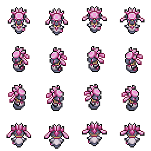

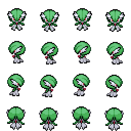
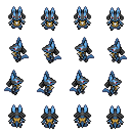


*Every agent gets its own Pokémon. Pick any of the 1,044 available — including shinies.*

[](LICENSE)
[](https://code.visualstudio.com/)

</div>

---

## What is this?

**The Office** is a VS Code extension that gives your AI coding agents (Claude Code, GitHub Copilot, OpenAI Codex) animated Pokémon characters that live in a virtual world alongside your code.

Each time you open an agent terminal, a Pokémon spawns and starts moving. It walks to a desk, sits down, and animates differently depending on what the agent is doing — typing when writing code, reading when searching files, bouncing when running commands. When it needs your attention, a speech bubble appears above its head.

---

## Choose any Pokémon

<div align="center">

### Eeveelutions

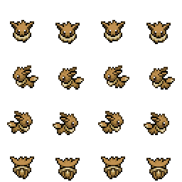
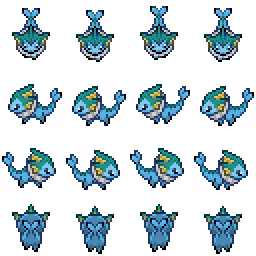
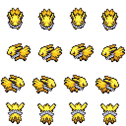
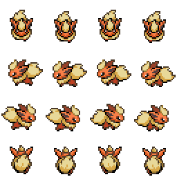
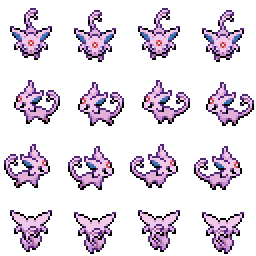
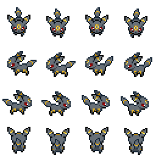
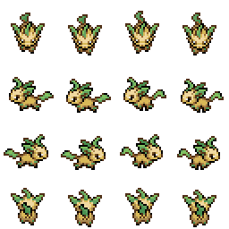
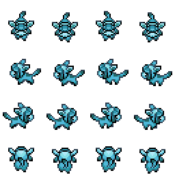
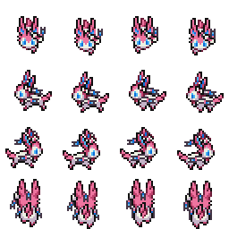

### With shiny variants ✦

 &nbsp; → regular
 &nbsp; → ✦ shiny

 &nbsp; → regular
 &nbsp; → ✦ shiny

 &nbsp; → regular
 &nbsp; → ✦ shiny

</div>

Pick from **1,044 Pokémon** — including all regional forms and variants. **1,042 have real shiny sprites** loaded from your `Pokemon Shiny/` folder (no CSS filter tricks).

---

## How it works

```
You open an agent terminal
        ↓
A Pokémon spawns in the world with a matrix-rain effect
        ↓
It pathfinds to an empty desk and sits down
        ↓
Its animation changes with the agent's activity:
  ⌨️  Writing/editing code  → typing animation
  📖  Reading/searching     → reading animation
  🖥️  Running bash/commands → fast bounce
  🔍  File search / grep    → sway animation
  💬  Waiting for you       → speech bubble + chime
        ↓
When the agent finishes its turn, the Pokémon idles and wanders
```

---

## Features

| Feature | Details |
|---|---|
| **1,044 Pokémon** | All species including forms, regional variants |
| **1,042 shiny sprites** | Real sprites from `Pokemon Shiny/` — not CSS filters |
| **Search & pick** | Instant searchable character picker, click ★ Char |
| **3 AI backends** | Claude Code · GitHub Copilot · OpenAI Codex |
| **Per-tool animation** | Different animation per agent action type |
| **ORAS scenes** | 5 Pokémon ORAS-style backgrounds |
| **Layout editor** | Full office editor with floors, walls, furniture |
| **Sub-agents** | Task tool sub-agents get their own Pokémon |
| **Persistent** | Layout saved to `~/.the-office/layout.json` |
| **Plugin themes** | ThemePack architecture — swap the whole visual theme |

---

## Scenes (LeoB ORAS Tileset)

Five scene backgrounds from the [LeoB ORAS tileset](https://github.com/TeamAquasHideout/Team-Aquas-Asset-Repo/tree/main/Tilesets/The%20Great%20Tileset%20Exchange/Full%20Tilesets/LeoB%20ORAS) by **leob0505**, styled after Pokémon Omega Ruby & Alpha Sapphire:

| Scene | Location |
|---|---|
| Littleroot Town | Starting town, grassy and peaceful |
| Route 102 | Outdoor route with tall grass |
| Oldale Town | Small town with Pokémon Center |
| Petalburg City | City with Gym and pond |
| Rustboro City | Rock-themed city with Devon Corp |

Switch between them any time from the **Settings** modal (⚙ gear icon).

---

## AI Backends

| Backend | How The Office watches it |
|---|---|
| **Claude Code** | Tails `~/.claude/projects/<workspace>/<session>.jsonl` |
| **GitHub Copilot** | Listens to `vscode.lm.onDidReceiveChatRequest` events |
| **OpenAI Codex** | Tails `~/.codex/sessions/<session>/events.jsonl` |

---

## Getting Started

### 1. Prerequisites

- VS Code 1.109.0 or later
- Pokémon sprites in a `Pokemon/` folder at the workspace root (256×256 PNG per Pokémon, e.g. `BULBASAUR.png`)
- Shiny sprites in `Pokemon Shiny/` (optional but recommended — same naming convention)
- At least one agent CLI (Claude Code, Copilot, or Codex)

### 2. Install from source

```bash
git clone https://github.com/kevanwee/theoffice.git
cd theoffice
npm install
cd webview-ui && npm install && cd ..
npm run build
```

### 3. Run it

Press **F5** in VS Code — this launches an **Extension Development Host** window with the extension loaded.

In that new window, find **The Office** panel in the bottom area (same row as the Terminal tab). Click **+ Agent** to spawn your first Pokémon.

---

## Choosing Your Pokémon

1. In The Office panel, select an agent (click its character in the world)
2. Click **★ Char** in the bottom toolbar
3. Search by name (try "diancie", "ceruledge", "eevee"…)
4. Toggle **✦ Shiny** to use the shiny sprite
5. Click **Assign**

<div align="center">
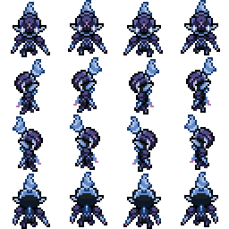

<br>
<em>Ceruledge · Shiny Ceruledge</em>
</div>

---

## Rebuilding the Catalog

If you add new sprites:

```bash
npm run build:pokemon-catalog
```

This re-scans `Pokemon/` and `Pokemon Shiny/` and writes `webview-ui/public/assets/themes/pokemon/catalog.json`.

---

## Architecture

### System Overview

The extension splits into two processes connected by `postMessage`. The extension host watches files and VS Code events; the webview renders the world on a Canvas at 60 fps.

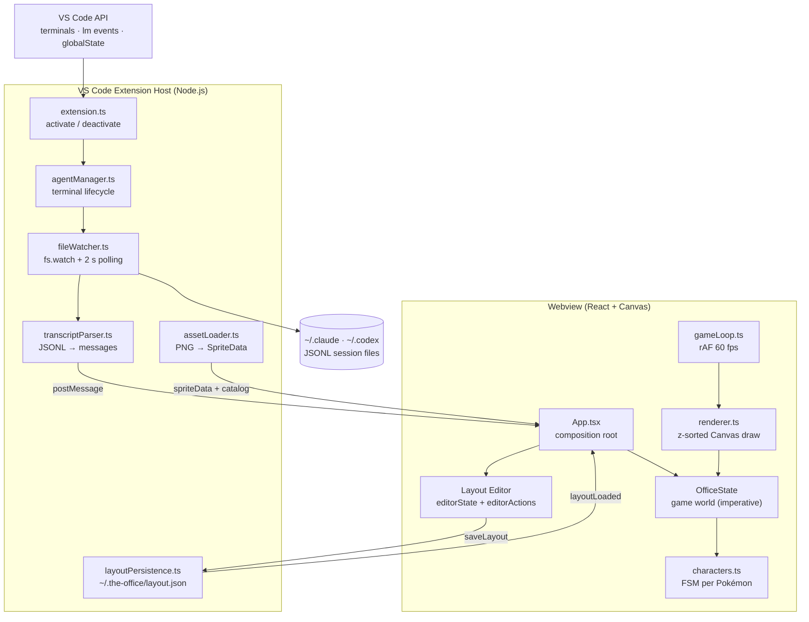

---

### Pokémon Character State Machine

Each Pokémon is a finite-state machine. `isActive` (agent busy) and `pokemonSpriteId` (character type) are the main guards that change which transitions fire.

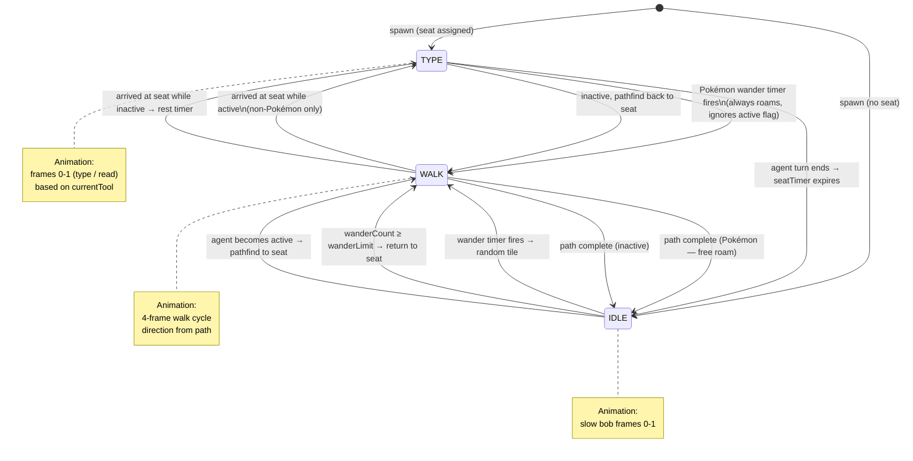

---

### Data Flow — JSONL to Animation

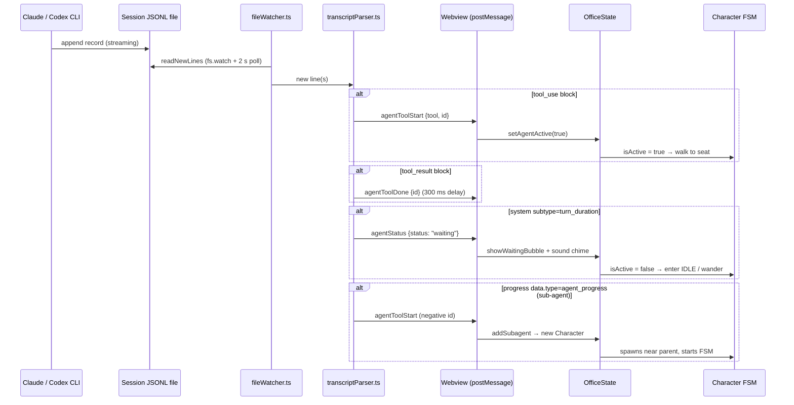

---

### Rendering Pipeline

Every frame the renderer z-sorts all drawables (tiles → furniture → wall instances → characters → bubbles) so entities overlap correctly without a separate depth buffer.

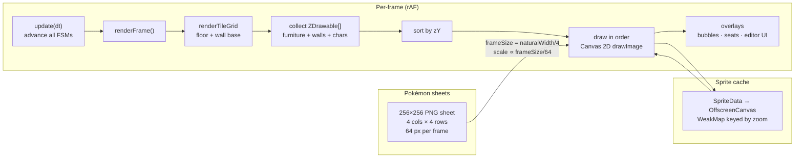

---

## Stack

| Layer | Tech |
|---|---|
| Extension host | TypeScript · esbuild · VS Code API |
| Frontend | React 19 · Vite 7 · Canvas 2D |
| Rendering | 60fps rAF loop · integer zoom · z-sorted entities |
| State | Imperative `OfficeState` class (off React tree) |
| Theming | `ThemePack` plugin interface · `ThemeRegistry` singleton |
| Sprites | 256×256 PNG → `vscode-resource:` URI → `` / `drawImage` |

---

## Credits

- **Pokémon sprites** — © Nintendo / Game Freak. Fan assets used for non-commercial personal use only.
- **ORAS tileset** — [LeoB ORAS](https://github.com/TeamAquasHideout/Team-Aquas-Asset-Repo) by **leob0505** via Team Aqua's Asset Repository, inspired by Pokémon ORAS.
- **Pixel office engine** — forked from [Pixel Agents](https://github.com/pablodelucca/pixel-agents) by Pablo De Lucca (MIT License). The rendering pipeline, layout editor, file-watcher architecture, and agent orchestration are substantially based on that work.

---

<div align="center">

*This project is not affiliated with or endorsed by Nintendo, Game Freak, or The Pokémon Company.*


</div>
